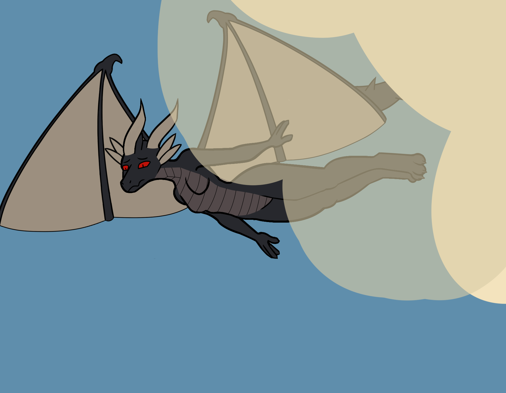

Amber.

Whispers of the mountain bear down on her, cold from the high peak. The sun's rays do little good here in presence of the beast, the colossal mass of stone, earth, ice, and low grass to be her marker. Her mind is racing. She's already died, the thoughts flying in her mind more surely than herself, ways to undo the mistakes of climbing too high on too little strength, hoping she would see something to eat, now only seeing the rapidly approaching ground. 

It had been days since the last time she ate, and the harder winds of the region always drive against her with their own unexpected, shifting invisible goals. Accurate to note, the dark intruder is the new aspect to the skies, rather than the wind itself. Wind only exists Amber, your invasion of it has been long tolerated, is it no wonder you'd fall from it climatically? Likely not to be buried, and picked apart by animals. 

Incredible, the options of her ruin are limitless. The side of the mountain as firm as it gets, forever preserved limbs clutched onto the edge of some high-up rock face. A bird's nest could be made from her bones, perhaps giving life where none would exist otherwise. There is also the grass scrub, or the channel of sand at the base of the mountain, or the dry river rocks. She could climb higher too, and would surely drop completely any moment after. Invisible knives are buried into her shoulders, and every additional second of holding her wings tight, of keeping herself aloft, their edge grows sharper.

Amber.

There is no going outside of this moment, not now. Counting isn't helping, the pain is real, impossible to ignore, and it is spreading. In her mind, she hopes she can hold it until she gets to the ground safely, like countless times before, but that will not happen in the 5 seconds of time she has left before falling. There's no infinite strength to her frame, this is it.
